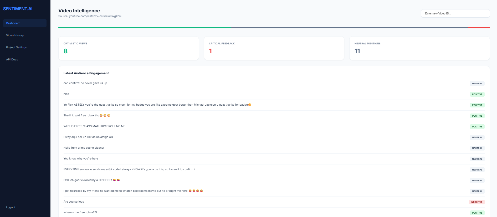

# sentiment-prediction-api
# YouTube Comment Sentiment Analyzer using FastAPI

## Overview

This project is a FastAPI-based sentiment analysis application that fetches comments from YouTube videos and classifies them as Positive, Negative, or Neutral using Natural Language Processing (NLP) techniques.

The application integrates the YouTube Data API to retrieve video comments and TextBlob to analyze sentiment polarity. Results are displayed through an interactive web dashboard built with FastAPI and Jinja2 templates.

## Features

* Fetch comments from any public YouTube video
* Clean and preprocess comment text
* Perform sentiment analysis using TextBlob
* Categorize comments into Positive, Negative, and Neutral classes
* Interactive dashboard for visualization
* FastAPI-based backend with REST endpoints
* Real-time sentiment statistics

## Technologies Used

* Python
* FastAPI
* TextBlob
* YouTube Data API
* Jinja2
* HTML/CSS
* Uvicorn

## Workflow

1. User enters a YouTube Video ID.
2. The application fetches comments using the YouTube Data API.
3. Comments are cleaned and preprocessed.
4. TextBlob calculates sentiment polarity.
5. Comments are classified into sentiment categories.
6. Results are displayed through a web dashboard with summary statistics.

## Future Enhancements

* Support for Twitter/X, Reddit, and Instagram data sources
* Machine Learning-based sentiment models
* Sentiment trend visualizations
* Database integration for historical analysis
* User authentication and project management

## Dashboard Preview

